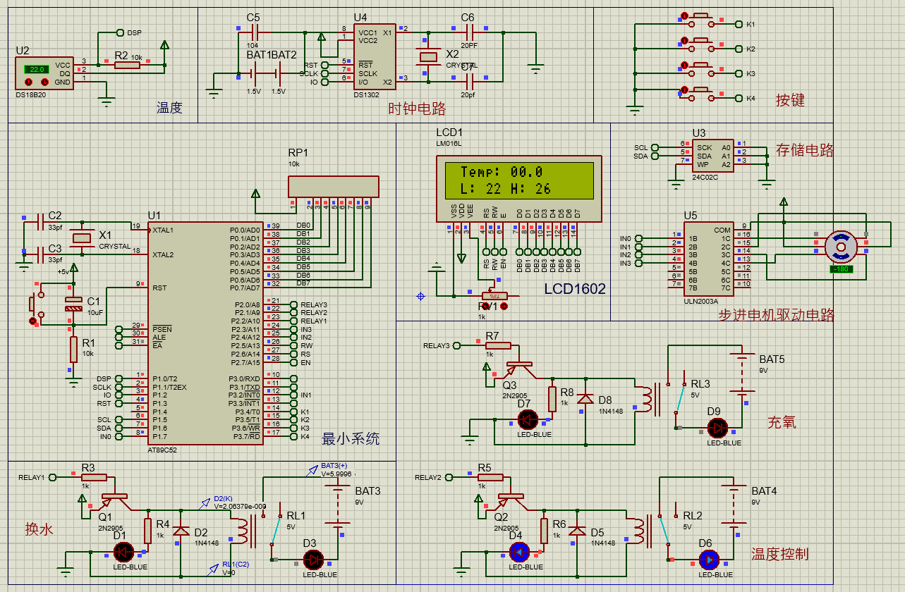
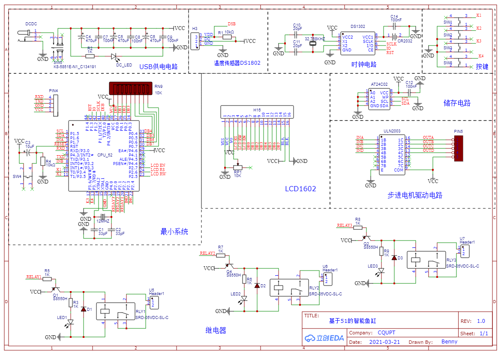
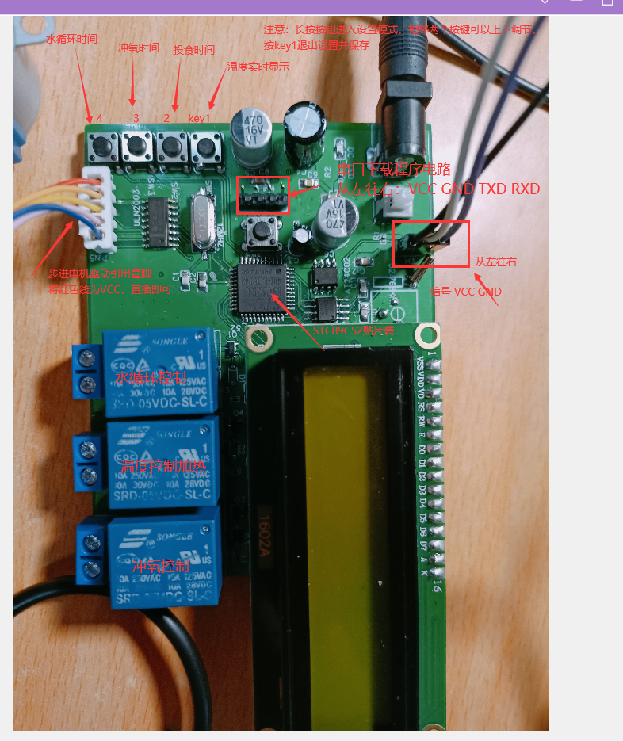

### 介绍

分享一个之前完成的设计项目——基于51单片机智能鱼缸设计与实现；但是，它不是那么智能，也并没有投入到实际的鱼缸中做测试，这里仅作为一个综合性系统项目分享，养鱼需谨慎哦。该功能板具备以下功能：

- 温度实时监测功能；
- 按时投食鱼料功能；
- 外部时钟精确计时，掉电不会丢失时间；
- 外部存储电路，通过按键设置水温、投食时间、时钟校准、水循环周期、充氧周期等参数，并存储在外部，掉电仍保存数据；
- LCD1602显示鱼缸当前状态；
- 三个扩展继电器外接加热设备、充氧设备、水循环设备。

### BOM

主要元器件如下表所示(电阻电容等器件见原理图)：

|      名称      |       作用       |
| :------------: | :--------------: |
|   STC89C52RC   |     51单片机     |
|    DS18B20     |    温度传感器    |
|     DS1302     |     时钟芯片     |
|    AT24C02     |   外部存储芯片   |
|    LCD1602     |    液晶显示器    |
|    ULN2003     | 步进电机驱动芯片 |
| SRD-05VDC-SL-C |      继电器      |

### Protues

Proteus仿真软件实现，但是温度传感器等无法在仿真中模拟采集，采用继电器控制LED灯显示程序执行效果，仿真原理图如下所示：



### 原理图

原理图使用立创EDA设计，这个项目是我很久以前做的了，也是第一次接触原理图和PCB绘制，很多电阻电容等元器件的封装选得不是很好，后面购买器件焊接是很麻烦，但是最后效果还是做出来了，可参照下图设计原理图：



实物图如下所示：



### 重要

该项目的Proteus仿真图、源码工程已经上传到Github，想要学习使用的可自行下载，懒得下载的也可以加我微信发给你。由于这段时间去外地实习了，平衡车项目没法继续更新了，过段时间回学校了继续分享。

```http
# github项目地址
https://github.com/Qin-Yuan/Intelligent_fish_tank
# gitee项目地址


```

